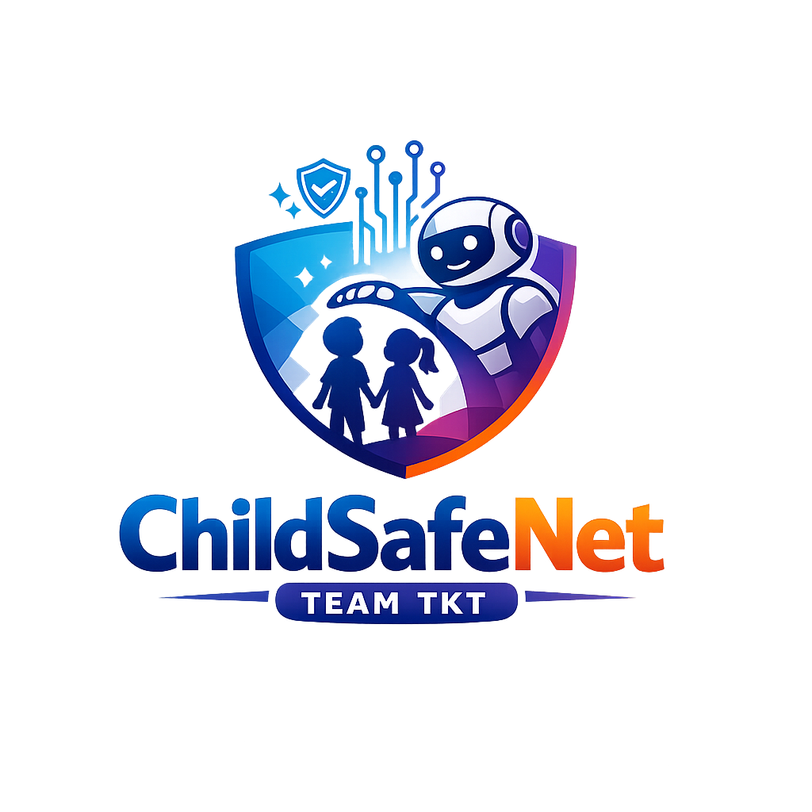
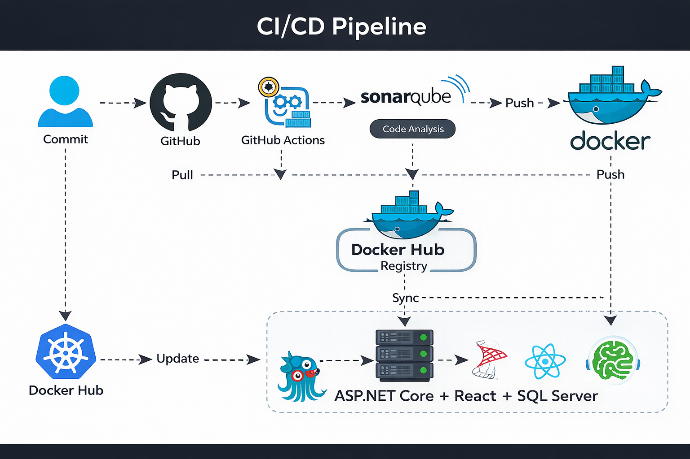
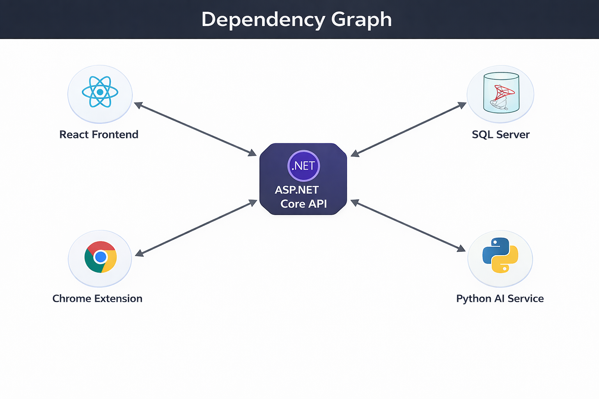

<p align="center">
  
</p>

<h1 align="center">ChildSafeNet</h1>

<p align="center">
  <b>AI-powered Internet Safety for Kids</b><br/>
  Chrome Extension + Web Dashboard + .NET API + FastAPI AI Service (Option B: Periodic Training)
</p>

<p align="center">
  <a href="#getting-started"><strong>Get Started »</strong></a>
  <br/><br/>
  <a href="./.github/ISSUE_TEMPLATE/bug_report.md">🐛 Report Bug</a>
  |
  <a href="./.github/ISSUE_TEMPLATE/feature_request.md">🚀 Request Feature</a>
  |
  <a href="./SUPPORT.md">💬 Support</a>
  |
  <a href="./SECURITY.md">🔐 Security</a>
</p>

<p align="center">
  
  
  
  
  
  
</p>


---

## Final Submission Edition (HUTECH / Hội thi CNTT 2025)

**Mục tiêu:** Bảo vệ trẻ em dưới 18 tuổi khi truy cập Internet bằng cách **phát hiện & cảnh báo/chặn** các trang web nguy hiểm như **Adult (18+) / Gambling / Phishing / Malware**.

**Điểm nổi bật (Option B — Tự train định kỳ):**
- ✅ Thu thập URL từ Web/Extension vào **Dataset (Pending)**
- ✅ **Admin duyệt** (Approve/Reject) để tránh “data bẩn”
- ✅ **Train định kỳ** (Background job) → sinh model mới (versioning)
- ✅ Dashboard theo dõi logs, dataset, train jobs
- ✅ Policy cá nhân hóa cho phụ huynh: Age / Mode / Toggles / Allowlist / Blocklist

> **Lưu ý:** Repo có thể chạy hoàn toàn local (ASP.NET Core + SQL Server + React). AI service (FastAPI) chạy local bằng Python.

---

## Features

### 👪 Parent (Phụ huynh)
- **Scan URL** (Web) + xem **Scan Logs**
- **Settings (/settings)**  
  - Child age (1–18)  
  - Mode: Strict / Balanced / Relaxed  
  - Rule toggles: Block Adult / Block Gambling / Block Phishing / Warn Suspicious  
  - Whitelist domains (always allow)  
  - Blacklist domains (always block)  
- **Pair Chrome Extension**: Web gửi token sang extension → extension scan theo API

### 🛡️ Admin
- **Admin Dataset**: xem URL đã thu thập (Pending/Approved/Rejected), Export CSV
- **Admin Train Jobs**: trigger train job, theo dõi status/version
- (Tùy chọn) Drift monitoring / model health (mở rộng)

### 🧩 Chrome Extension
- Bật/tắt Extension
- Auto-scan tab hiện tại, gọi API `/api/scan`
- BLOCK/WARN theo policy (hiển thị trang block)

---

## Architecture


**Luồng tổng quát:**
1) Extension/Web gửi URL → **ASP.NET Core API** (`/api/scan`)  
2) API gọi **AI Service (FastAPI)** (`/predict`)  
3) API áp dụng **User Settings + allow/block list** → trả action ALLOW/WARN/BLOCK  
4) API ghi **ScanLogs** + upsert **UrlDataset (Pending)**  
5) Background job train định kỳ → xuất model version mới → AI service reload

---

## Repository Structure

```txt
ChildSafeNet/
├─ src/
│  ├─ api/                 # ASP.NET Core (.NET 8) + EF Core + SQL Server
│  ├─ web/                 # React + TypeScript (Vite)
│  ├─ ai-service/          # FastAPI (Python) - model inference
│  └─ chrome-extension/    # Manifest v3 extension
├─ assets/                 # banners, screenshots, diagrams
├─ .github/                # templates, workflows, CODE_OF_CONDUCT, CONTRIBUTING
└─ README.md
```

---

## Tech Stack

- **Frontend:** React + TypeScript + Vite
- **Backend:** ASP.NET Core 8, EF Core, JWT Auth, Background Services
- **Database:** SQL Server (LocalDB / SQL Server local)
- **AI Service:** FastAPI + scikit-learn (RF / Pipeline joblib)
- **Extension:** Chrome/Edge MV3 (service worker + content script)

---

## Getting Started

### 🧰 Prerequisites
- .NET SDK **8.0**
- Node.js **18+**
- Python **3.10–3.12**
- SQL Server local (or LocalDB)
- (Optional) Docker Desktop — nếu dùng Docker

### 1) Backend (.NET API)
```bash
cd src/api
dotnet restore
dotnet ef database update
dotnet run
```
- Swagger: `https://localhost:7047/swagger` (hoặc port của bạn)

### 2) AI Service (FastAPI)
```bash
cd src/ai-service
python -m venv .venv
# Windows
.\.venv\Scripts\activate
# macOS/Linux
# source .venv/bin/activate

pip install -r requirements.txt
python -m uvicorn app:app --host 0.0.0.0 --port 8000
```
- Health: `http://localhost:8000/health`

> **Model files** đặt trong `src/ai-service/model/`  
> - `childsafenet_rf.pkl`  
> - `childsafenet_pipeline.joblib`  
> - `label_encoder.pkl` (nếu dùng)

### 3) Frontend (React)
```bash
cd src/web
npm install
npm run dev
```
- Web: `http://localhost:5173`

### 4) Chrome Extension (unpacked)
1. Mở `chrome://extensions` (Edge: `edge://extensions`)
2. Bật **Developer mode**
3. **Load unpacked** → chọn thư mục `src/chrome-extension`
4. Mở web dashboard → **Dashboard** → “Kết nối Extension”

---

## Demo Flow

### A) Web Scan
1. Login (Parent)
2. Mở trang **Scan** nhập URL → nhận action ALLOW/WARN/BLOCK
3. Vào **Dashboard** xem logs

### B) Extension Pair + Auto Scan
1. Login (Parent) trên web
2. Dashboard → “Kết nối Extension” (pair token)
3. Mở tab bất kỳ → extension tự gọi `/api/scan`
4. Nếu BLOCK → chuyển sang `block.html`

### C) Option B Training
1. URL mới → vào **UrlDataset (Pending)**
2. Admin → **AdminDataset** → approve/reject
3. Admin → **AdminTrainJobs** → trigger train job (background)
4. AI service reload model version mới

---

## Environment Variables

### API (`src/api/appsettings.json`)
- `ConnectionStrings:Default`
- `Jwt:Key`, `Jwt:Issuer`, `Jwt:Audience`
- `AiService:BaseUrl` (vd: `http://localhost:8000`)

### Web (`src/web/.env`)
```env
VITE_API_BASE=https://localhost:7047
```

### Extension (nếu cần)
- dùng message pair token từ web, lưu token vào storage

---

## CI/CD



- **CI:** lint + test + build (API/Web/AI)
- **CD (optional):** build images + publish artifacts (nếu deploy)

---

## Dependency Graph



---

## Contributing
- Xem hướng dẫn tại: **[CONTRIBUTING.md](./CONTRIBUTING.md)**
- Quy tắc ứng xử: **[CODE_OF_CONDUCT.md](./CODE_OF_CONDUCT.md)**
- Báo lỗi/tính năng: `.github/ISSUE_TEMPLATE/*`

---

## Security
Vui lòng đọc **[SECURITY.md](./SECURITY.md)** và không public issue các lỗ hổng bảo mật.

---

## License
MIT License — xem **[LICENSE](./LICENSE)**.

---

### Credits
- Team/Author: **Nguyễn Tri Bão Thắng** (demo project)