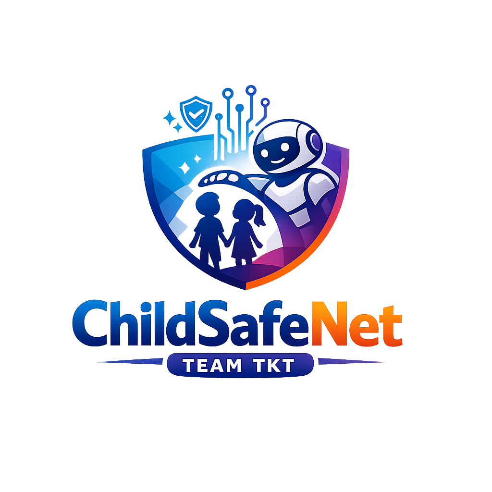
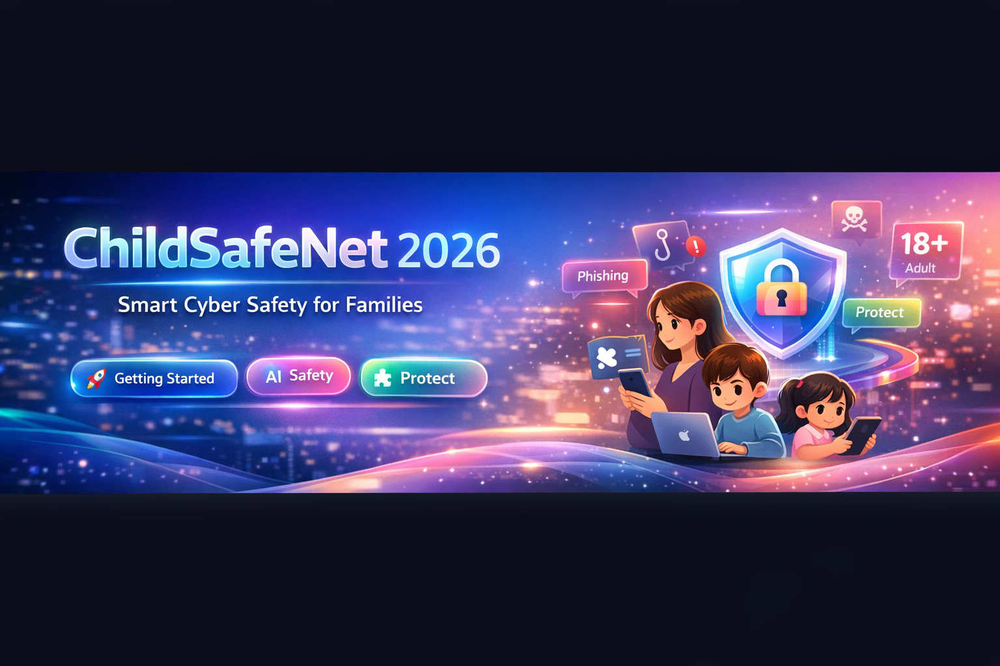
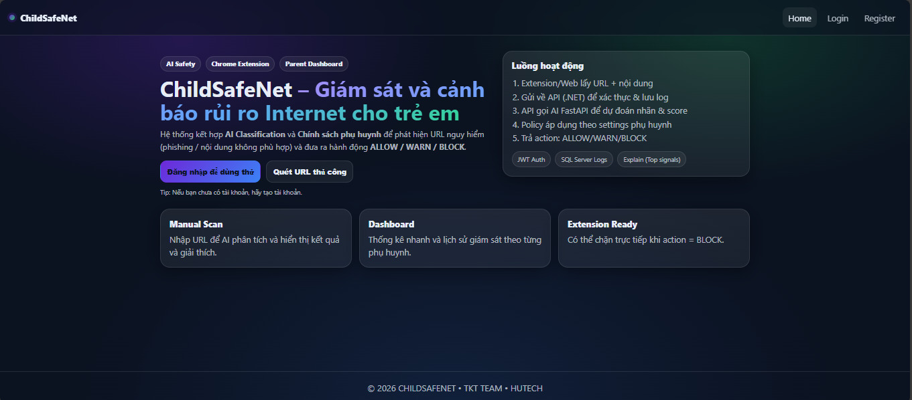
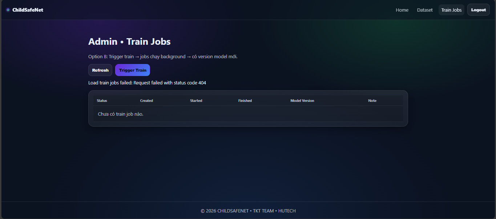
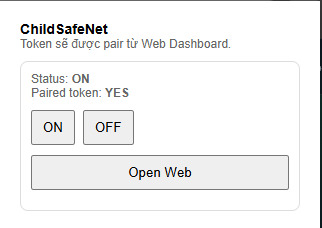
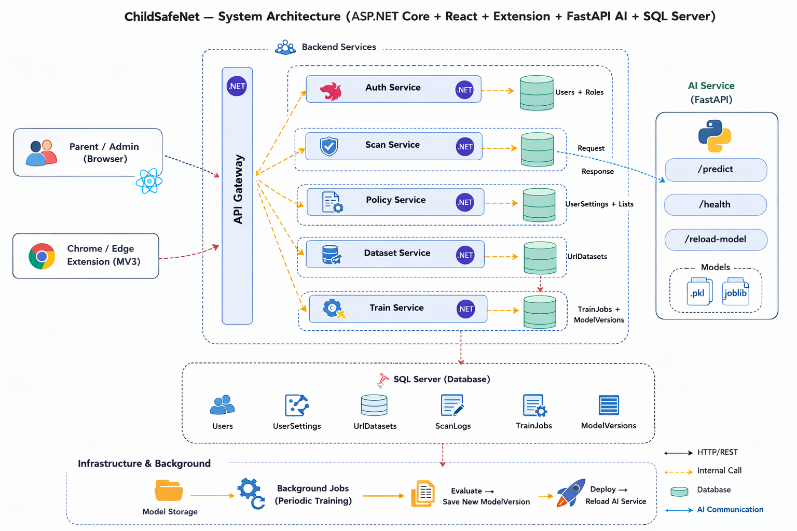
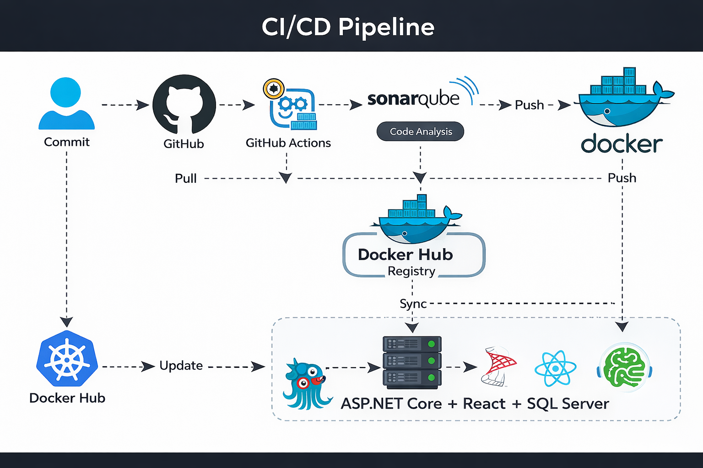
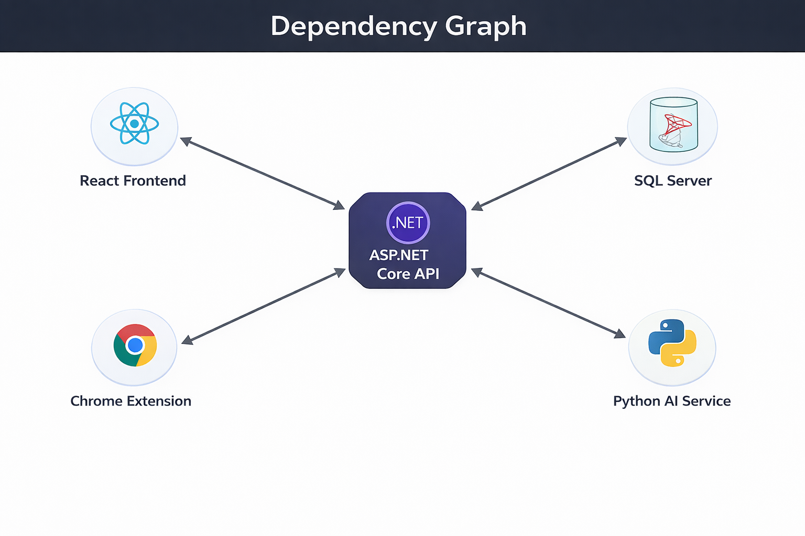

<p align="center">
  
</p>

<h1 align="center">ChildSafeNet</h1>

<p align="center">
  <b>Protecting children from harmful content with AI-powered, parent-controlled browsing safety</b>
</p>

<p align="center">
  <a href="https://nguyentribaothang.github.io/Childsafenet">
    
  </a>
  <a href="https://github.com/NguyenTriBaoThang/ChildSafeNet/actions/workflows/ci.yml">
    
  </a>
  <a href="https://github.com/NguyenTriBaoThang/ChildSafeNet/stargazers">
    
  </a>
</p>

<p align="center">
  <b>AI-powered Internet Safety for Kids</b><br/>
  Chrome Extension + Web Dashboard + .NET API + FastAPI AI Service (Option: Periodic Training)
</p>

<p align="center">
  <a href="http://180.93.2.24:5173/"><strong>Explore the Website »</strong></a>
  <br/><br/>
  <a href="./.github/ISSUE_TEMPLATE/bug_report.md">🐛 Report Bug</a>
  |
  <a href="./.github/ISSUE_TEMPLATE/feature_request.md">🚀 Request Feature</a>
  |
  <a href="./SUPPORT.md">💬 Support</a>
  |
  <a href="./SECURITY.md">🔐 Security</a>
</p>

<p align="center">
  
  
  
  
  
  
</p>



---

## Final Submission Edition

<p align="center">
  <b>WEBSITE & AI INNOVATION CONTEST 2026 – BOARD B (Advanced Track)</b>
</p>

**Objective:** Protect children under 18 while browsing the Internet by **detecting & warning/blocking** dangerous websites such as **Adult (18+) / Gambling / Phishing / Malware**.

**Highlight Feature (Option Periodic — Periodic Training):**

- ✅ Collect URLs from Web/Extension into **Dataset (Pending)**
- ✅ **Admin review** (Approve/Reject) to prevent “dirty data”
- ✅ **Periodic training** (Background job) → generate new model (versioning)
- ✅ Dashboard to monitor logs, dataset, and training jobs
- ✅ Personalized policies for parents: Age / Mode / Toggles / Allowlist / Blocklist

> **Lưu ý:** The repository can run completely locally (ASP.NET Core + SQL Server + React). The AI service (FastAPI) runs locally with Python.

---

## Screenshots

<table align="center">
<tr>
<td align="center" width="33%">



<b>Web Dashboard</b>

</td>

<td align="center" width="33%">



<b>Admin Dataset Review</b>

</td>

<td align="center" width="33%">



<b>Chrome Extension</b>

</td>
</tr>
</table>

---

## Why ChildSafeNet?

Children are increasingly exposed to harmful online content.
Traditional blacklist systems are static and easily bypassed.

ChildSafeNet introduces:

- AI-driven URL classification
- Policy personalization by age & mode
- Periodic retraining pipeline
- Admin-controlled dataset validation

This creates a semi-automated moderation loop instead of static blacklists.

---

## Features

### 👪 Parents

- **Scan URL** (Web) + view **Scan Logs**
- **Settings (/settings)**
  - Child age (1–18)
  - Mode: Strict / Balanced / Relaxed
  - Rule toggles: Block Adult / Block Gambling / Block Phishing / Warn Suspicious
  - Whitelist domains (always allow)
  - Blacklist domains (always block)
- **Pair Chrome Extension**: Web sends token to extension → extension scans using API

### 🛡️ Admin

- **Admin Dataset**: view collected URLs (Pending/Approved/Rejected), Export CSV
- **Admin Train Jobs**: trigger training job, monitor status/version
- (Optional) Drift monitoring / model health (future extension)

### 🧩 Chrome Extension

- Enable/disable Extension
- Auto-scan current tab, call `/api/scan` endpoint
- BLOCK/WARN based on policy (shows block page when needed)

---

## Architecture



**Luồng tổng quát:**

1. Extension/Web sends URL → **ASP.NET Core API** (`/api/scan`)
2. API calls **AI Service (FastAPI)** (`/predict`)
3. API applies **User Settings + allow/block list** → returns action ALLOW/WARN/BLOCK
4. API logs **ScanLogs** + upserts **UrlDataset (Pending)**
5. Background job periodically trains → exports new model version → AI service reloads

---

## System Design Highlights

- Clean separation: API / AI Service / Web / Extension
- Background training with versioned models
- Dataset moderation workflow (Pending → Approved → Train)
- Policy engine layer before final action (ALLOW/WARN/BLOCK)

---

## Key Technical Decisions

- **Why FastAPI for AI inference?** → Extremely fast, async, auto-generated docs, easy to version models
- **Why background job for training?** → Avoid blocking API, support model versioning & rollback
- **Why Manifest V3 for extension?** → Future-proof, better security & performance
- **Why scikit-learn instead of deep learning?** → Lightweight, fast inference on local machine, explainable

---

## Repository Structure

```txt
ChildSafeNet/
│
├── src/                          # Main application source code
│   │
│   ├── api/                      # ASP.NET Core 8 Web API (Backend)
│   │   ├── Controllers/          # REST API endpoints
│   │   ├── Services/             # Business logic & background jobs
│   │   ├── Data/                 # EF Core DbContext & migrations
│   │   ├── Models/               # Entities, DTOs, request/response models
│   │   ├── Middlewares/          # Custom middleware (Auth, Logging...)
│   │   ├── Background/           # Periodic training & scheduled tasks
│   │   └── Program.cs            # Application entry point
│   │
│   ├── web/                      # React + TypeScript Dashboard (Vite)
│   │   ├── src/
│   │   │   ├── pages/            # Main pages (Scan, Dashboard, Settings, Admin)
│   │   │   ├── components/       # Reusable UI components
│   │   │   ├── api/              # Axios API client & request wrappers
│   │   │   ├── hooks/            # Custom React hooks
│   │   │   ├── context/          # Global state / auth context
│   │   │   └── utils/            # Helper utilities
│   │   ├── public/
│   │   └── vite.config.ts
│   │
│   ├── ai-service/               # FastAPI AI Inference Service
│   │   ├── app.py                # FastAPI entry point
│   │   ├── model/                # Trained models (.pkl, .joblib)
│   │   ├── training/             # Training pipeline scripts
│   │   ├── dataset/              # Optional datasets used for training
│   │   └── requirements.txt
│   │
│   └── chrome-extension/         # Chrome / Edge Extension (Manifest V3)
│       ├── manifest.json         # Extension configuration
│       ├── service-worker.js     # Background service worker
│       ├── content-script.js     # Page interaction script
│       ├── popup.html
│       ├── popup.js              # Extension popup UI logic
│       └── block.html            # Page displayed when a site is blocked
│
├── docs-site/                    # Docusaurus documentation website
│   ├── docs/                     # Technical documentation pages
│   ├── src/                      # Custom UI components & styles
│   ├── static/                   # Static assets
│   └── docusaurus.config.js
│
├── assets/                       # Visual assets for README/docs
│   ├── banner.jpg
│   ├── screenshots/              # UI screenshots
│   ├── diagrams/                 # Architecture / CI-CD diagrams
│   └── images/                   # Logos and other images
│
├── .github/                      # GitHub configuration
│   ├── workflows/                # GitHub Actions CI/CD pipelines
│   ├── ISSUE_TEMPLATE/           # Issue templates
│   └── PULL_REQUEST_TEMPLATE.md  # Pull request template
│
├── docker-compose.yml            # Local development environment (API + AI + Web)
│
├── CONTRIBUTING.md               # Contribution guidelines
├── CODE_OF_CONDUCT.md            # Community rules
├── SECURITY.md                   # Security policy
├── SUPPORT.md                    # Support information
├── LICENSE                       # MIT license
└── README.md                     # Project overview
```

---

## Tech Stack

- **Frontend:** React + TypeScript + Vite
- **Backend:** ASP.NET Core 8, EF Core, JWT Auth, Background Services
- **Database:** SQL Server (LocalDB / SQL Server local)
- **AI Service:** FastAPI + scikit-learn (RF / Pipeline joblib)
- **Extension:** Chrome/Edge MV3 (service worker + content script)

---

## Getting Started

### 🧰 Prerequisites

- .NET SDK **8.0**
- Node.js **18+**
- Python **3.10–3.12**
- SQL Server local (or LocalDB)
- Docker Desktop (recommended for easiest setup & demo)

### Quick Start with Docker (Recommended for Testing & Demo)

```bash
# Clone the repository
git clone https://github.com/NguyenTriBaoThang/ChildSafeNet.git
cd ChildSafeNet

# Start all services (API + AI Service + Web Dashboard)
docker-compose up -d --build
```

Once everything is up (may take a few minutes for the first build):

- **Web Dashboard**: http://localhost:5173
- **API Swagger**: http://localhost:7047/swagger
- **FastAPI Docs/Health**: http://localhost:8000/docs or http://localhost:8000/health
- **Database**: SQL Server will be initialized automatically via migrations
  **To stop:**

```bash
docker-compose down
```

### Manual Setup (Without Docker)

### 1) Backend (.NET API)

```bash
cd src/api
dotnet restore
dotnet ef database update
dotnet run
```

- Swagger UI: `https://localhost:7047/swagger` (or your actual port)

### 2) AI Service (FastAPI)

```bash
cd src/ai-service
python -m venv .venv
# Windows
.\.venv\Scripts\activate
# macOS/Linux
# source .venv/bin/activate

pip install -r requirements.txt
python -m uvicorn app:app --host 0.0.0.0 --port 8000
```

- Health check: `http://localhost:8000/health`

> **Model files** should be placed in `src/ai-service/model/`
>
> - `childsafenet_rf.pkl`
> - `childsafenet_pipeline.joblib`
> - `label_encoder.pkl` (if used)

### 3) Frontend (React)

```bash
cd src/web
npm install
npm run dev
```

- Web app: `http://localhost:5173`

### 4) Chrome Extension (unpacked)

1. Open `chrome://extensions` (or `edge://extensions` for Edge)
2. Enable **Developer mode**
3. Click **Load unpacked** → select folder `src/chrome-extension`
4. Open web dashboard → **Dashboard** → “Connect Extension”

---

## Demo Flow

### A) Web Scan

1. Login as Parent
2. Go to **Scan** page, enter URL → receive ALLOW/WARN/BLOCK result
3. View history in **Dashboard** → Scan Logs

### B) Extension Pair + Auto Scan

1. Login as Parent on web
2. Dashboard → “Connect Extension” (pair token)
3. Open any tab → extension automatically calls `/api/scan`
4. If BLOCK → redirects to custom `block.html` page

### C) Option Periodic Training

1. New URLs → added to **UrlDataset (Pending)**
2. Admin → **AdminDataset** → approve/reject
3. Admin → **AdminTrainJobs** → trigger train job (background)
4. AI service reloads the new model version

---

## Environment Variables

### API (`src/api/appsettings.json`)

- `ConnectionStrings:Default`
- `Jwt:Key`, `Jwt:Issuer`, `Jwt:Audience`
- `AiService:BaseUrl` (vd: `http://localhost:8000`)

### Web (`src/web/.env`)

```env
VITE_API_BASE=https://localhost:7047
```

### Extension

- Receives pairing token from web via message, saves to chrome.storage

---

## CI/CD



- **CI:** lint + test + build (API/Web/AI)
- **CD (optional):** build images + publish artifacts

### CI/CD Pipeline

1. Developer pushes code to GitHub
2. GitHub Actions triggers CI pipeline
3. Build & Test (API + Web)
4. Static code analysis (SonarQube)
5. Docker image build
6. Push image to registry
7. Deploy to server (ASP.NET + React + AI Service)
8. Services connected to SQL Server

---

## Dependency Graph



---

## Future Improvements

- Real-time model drift detection
- Federated learning approach
- Multi-language URL content analysis
- Cloud deployment (Azure/AWS)
- Parental analytics dashboard

---

## Contributing

- Please see: **[CONTRIBUTING.md](./CONTRIBUTING.md)**
- Code of Conduct: **[CODE_OF_CONDUCT.md](./CODE_OF_CONDUCT.md)**
- Report bugs / suggest features: `.github/ISSUE_TEMPLATE/*`

---

## Security

Please read **[SECURITY.md](./SECURITY.md)** and **do not** report security vulnerabilities publicly in issues.

---

## License

MIT License — see the **[LICENSE](./LICENSE)** file for details.

---

### Credits

**Team:** TKT Team

**Instructor**:
- ThS. Nguyen Trong Minh Hong Phuoc
  
**Contributors:**

- Nguyen Tri Bao Thang
- Le Trung Kien
- Vo Thanh Trung

---

Built with ❤️ for safer internet experiences for children.
